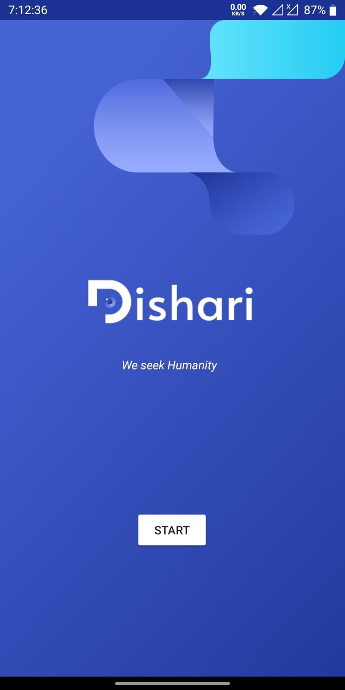
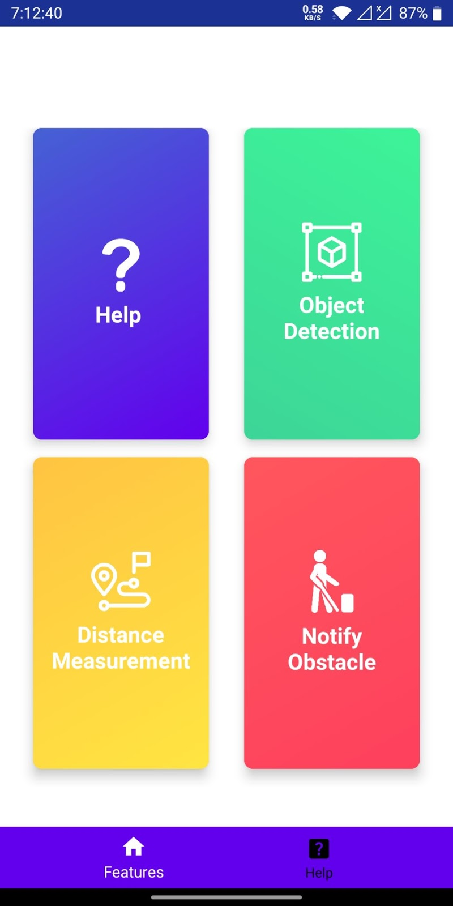
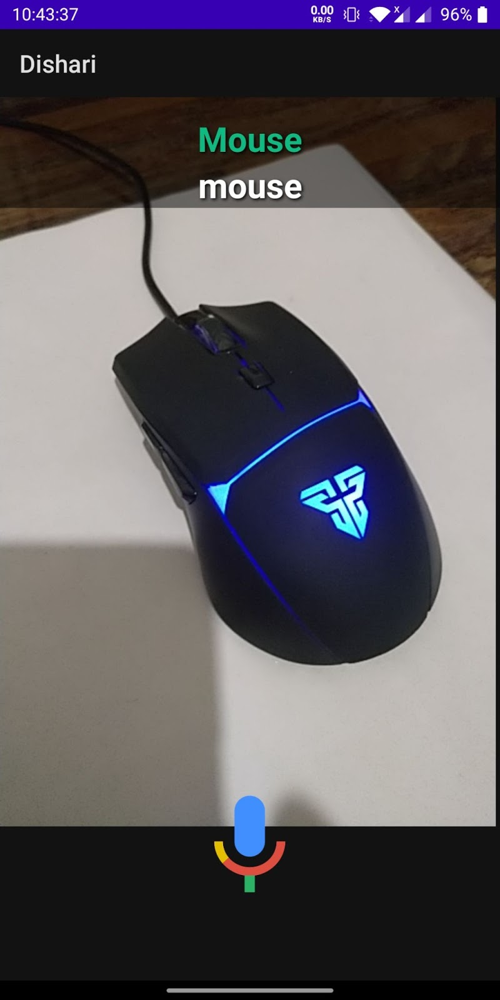
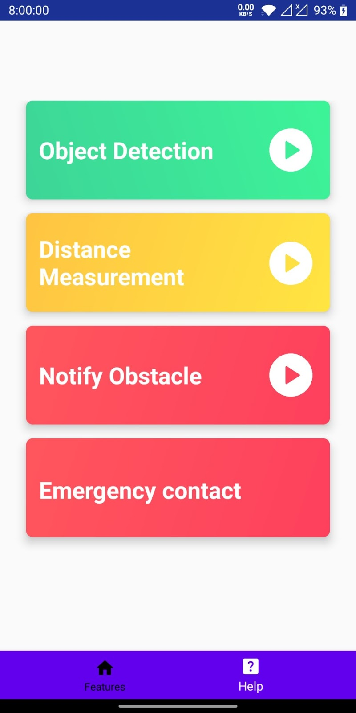
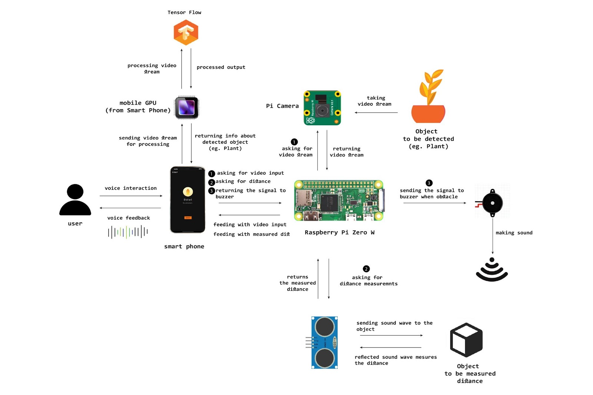

  

<h1 align="center">Dishari</h1>
<h2 align="center">
To seek the humanity
</h2>

## Introduction

The purpose of our project, Dishari, is to develop an application which will be helping the hands of visually impaired and blind people in their daily life.
Our project is specifically designed for the use of blind people who are adults and have knowledge of using smart mobile phones.

## Introductory Video

## UI Workthrough

## Tools Used

- Java
- Tensorflow
- Raspberry Pi Zero W
- Raspberry Pi Camera
- Sonar

## System Architecture

